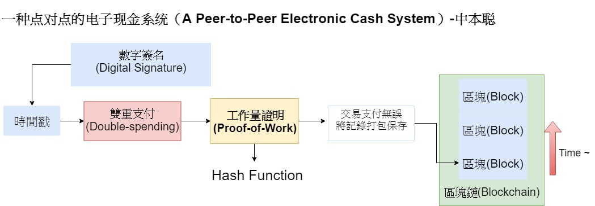
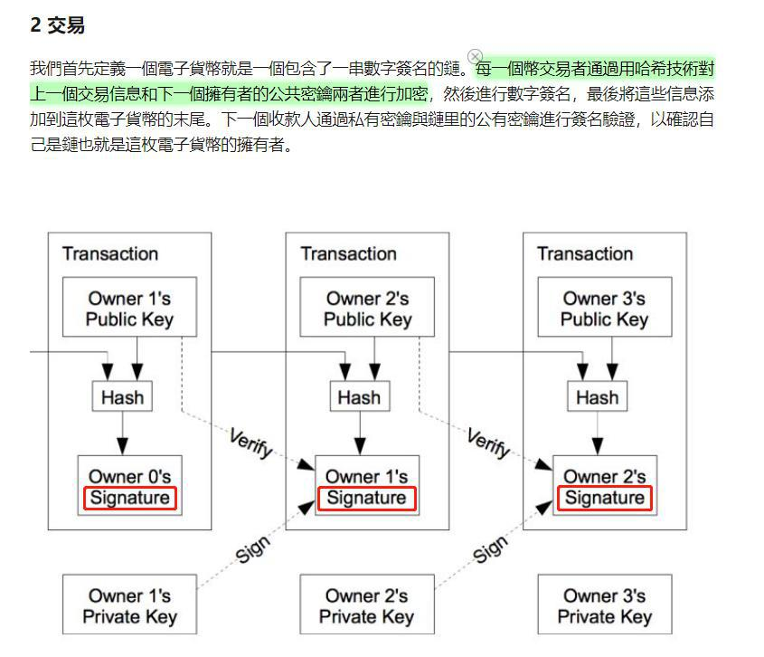

# 【白皮書導讀】

這篇論文所使用的電腦技術一點都不新、完全是一二十年前的電腦科學技術，但這篇論文中內容所提到的概念、卻是前所未見的，甚至可以說是驚為天人的。

針對比特幣論文需要了解的是他所闡明、結合的技術有哪些。

* 點對點技術
* 數字簽名
* 雙重支付
* 時間戳
* 工作量證明
* 遵循最長的鏈為真實帳本

我知道看完這幾行感覺會跟沒看一樣，就算畫上重點也還是一樣；  
所以我們用更好理解的方式，用這張圖**架構**出了我們需要如何理解比特幣背後運作的方式。

## 數位簽章\(Digital Signature\)

首先我們先提提有關**數位簽章**\(Digital Signature\)；

**加密貨幣**\(Cryptocurrency\)是來自於密碼學與貨幣作結合而生。而不管是比特幣還是信用卡或是你的銀行帳戶，有太多地方都涉及加密學了加密的種類有很多，這邊要提的是SHA256。

首先，你不一定需要完全了解BTC運作原理就好比你不知道信用卡怎麼加密你依舊可以使用這項科技。

#### 把時空拉回至人類開始交易的行為，一開始的方式是什麼？

是價值的轉移、或是說貨幣的轉移，當我們發生轉移時往往是將交易的過程與紀錄寫下來，而寫上去、記錄這些過程的地方我們常稱作**帳本**\(Ledger\)。

當記帳完成後我們會如何? 我們會簽上自己的名字，代表交易完成或者同意。

同樣道理，我們可以將比特幣在Peer-to-peer之間的轉移、視為寫入進一個共同維護的巨型帳本，而確認交易的轉移成功與否我們需要採用數位簽章\(Digital Signature\)來代表跟手寫簽名一樣的效力。

現在你能了解需要設計”數位簽章”的目的了，接下來得說說它是如何而來。

### 公鑰 & 私鑰

在比特幣的區塊鏈網路中，每個人都可以隨機產生出自己的**公鑰\(Public Key\)**、**私鑰\(Private Key\)**；

**公鑰**相當於收件地址、可以像QR Code一樣展示給大家讓大家傳送BTC給你；所以公鑰可以意味著你的收款地址；**私鑰**則代表你的個人帳戶密碼與隱私、是個至關重要的資料數字，因為它跟你的數位簽章\(Digital Signature\)有關。

#### 而整體的加密過程與數位簽章彼此的關係函式就像是

$$
簽名( 信息 ,   Private Key ) =>  Signature
$$

$$
驗證 ( 信息, Signature , Public Key)  => 正確 / 錯誤
$$

會利用到所謂的SHA256函式加密，每筆你要傳送的**資料、資訊、交易紀錄\(Message\)**，搭配你的私鑰進行SHA256加密形成數位簽章。

這意味著，每次**傳送資料的不同**、你所**產出的”數位簽章”**也會不同。

而整筆函式的運作與加密，是**不可反向推倒回去**的，原因牽涉到加密學。你有興趣的話極度建議你可以在網路搜尋嘗試了解SHA256以外的其他加密方式。

#### 最後，則是我們該如何驗證這筆傳送的資料是正確的呢？

倘若你不知道私鑰\(Private Key\)的情況下、你根本不知道正確的數位簽章\(Signature\)是多少所以方法便是用最簡單的方式，去猜測這個數字是多少！這便是礦工們在做的事情，他們執行一大堆電腦去運算、猜測這個答案為多少而耗費電力與硬體的礦工，在找出正確的數位簽章的同時，則能得到比特幣當作獎勵。

##  **誰來記賬區塊——工作量證明**

如果只是把交易簡單的組織在一起，是非常容易的事情，任何一個礦機都可以輕松完成。大家都可以輕松打包記錄的事情，作為獎勵的報酬給誰？這里就得來個“裁判”了，這里的“裁判”就是工作量證明（Proof Of Work，簡稱POW）

> #### 「大家來算一條數學題吧，誰先算出，打包權和獎勵金歸誰。」

關鍵字: Bitcoin、

## UTXO－錢不會無中生有

首先這邊有個場景是假如某個傢伙**”到處跟人借錢”**&**”到處告訴大家說他已付款”，**其實這兩種情形都差不多；而問題的癥結點會在「**如何避免有人花超過自己所擁有的實際金額**」。

那麼要解決這個問題，我們得回想起數位簽章的情形。首先，每筆交易內的資料內容都不同、所轉換出的數位簽章也不同。

而避免紀錄交易的順序發生混淆、每筆交易其實都有附帶自己的”**時間戳**”。所以排序好交易順序這件事情就沒有太大問題，最讓人頭疼的會是**”該如何避免某人重複花費?**”

也就是像這個情形: 甲不斷地提出交易記錄說、他一直支付出去就如同我們剛剛才提過的場景，所以為了解決這件事情得提到一個重要的概念”UTXO”帳本。

> **「大家的金流是在一個大型帳本內互相轉移貨幣、或者錢\(money\)」**

舉例來說，像這邊這張圖一樣 對於彭于晏來說他所持有的錢，等於過去所有人傳過給他的總和。由於過去兩筆資料的傳入、導致此時的他擁有5個BTC。當他打算將BTC傳送給對方時，傳送的資料會附帶他過去所收到的傳送歷史與資料序號。做數量的加總、以及記錄過  去的來源歷史導致杰倫收到帳的時候，可以根據過去的紀錄知道說「嗯，彭于晏真的擁有5個BTC，然後現在傳送給我了」

而這也是區塊鏈與比特幣**”最重要最重要的”核心概念**，資料彼此是前後相關聯的。這也是那篇比特幣論文最讓人讚嘆的特點之一，而間接的形成進一步的區塊鏈概念。

在比特幣這種加密貨幣的世界裡面，沒有所謂憑空而生、或是過度花費的貨幣\(Currency\)；原因就是因為貨幣\(Bitcoin\)的總量就是那麼固定。

這也是為什麼比特幣並沒有完全匿名的功能與難以查驗與追蹤的原因。因為你每一”份額”、每一分所持有的BTC都是可以追溯它是從哪裡被挖出的、自哪一個礦池中被產出的。

#### 至於初始的BTC如何被創造？

這會跟我們後續會提到的礦工紀錄、與運算獎勵有關，來讓整個比特幣”池”的總額慢慢增加，直到最後的總量會卡在2100萬枚。

總量的關係與等比級數的總和有關。不過別擔心，至於總量的限制與獎勵我們後面會提得更詳細。

## Proof of Work 工作量證明

打包區塊內的資料、嘗試計算出符合該區塊Hash加密算法的Nounce值，此一連串計算動作便是POW存在的需要。

參考此一網站:  [https://anders.com/blockchain/hash.html ](https://anders.com/blockchain/hash.html)

