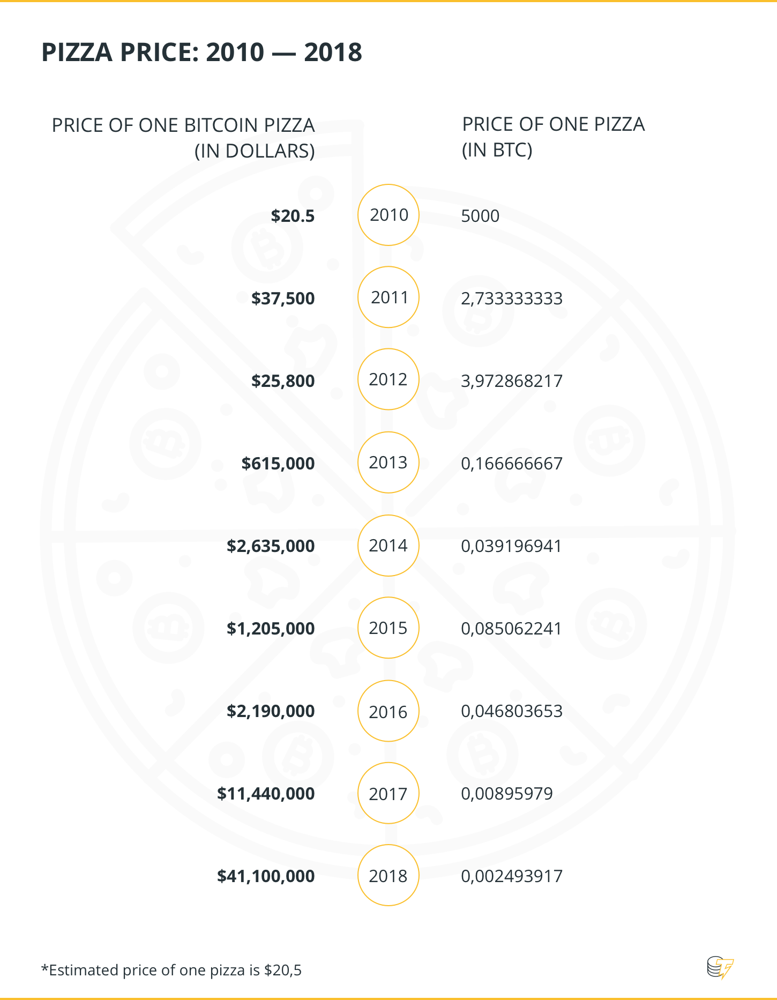
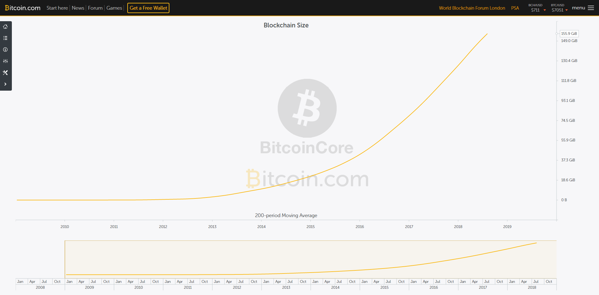
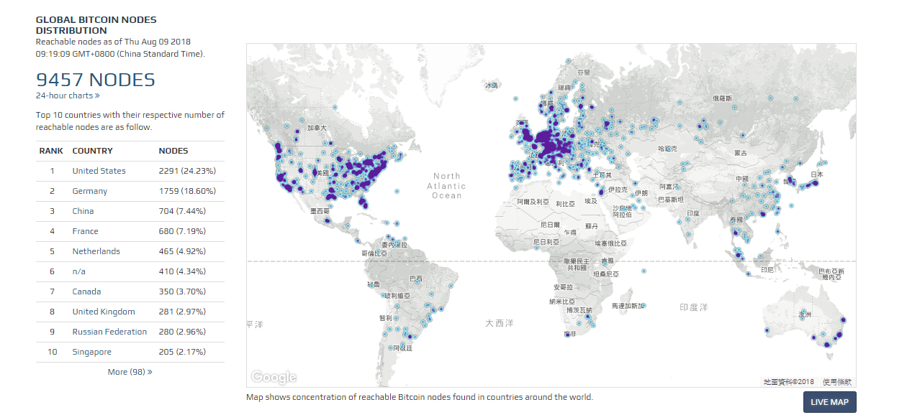

# Bitcoin's 基本資料

 2010年5月23日，在第一次比特幣交易中，佛羅里達程序員Laszlo Hanyecz用1萬BTC購買了價值約20美元的披薩，而這些比特幣近期價值已經上億了。這也衍生了每年的5月23日為比特幣披薩日－[Bitcoin Pizza Day](https://cointelegraph.com/news/bitcoin-pizza-day-8-years-later-where-can-you-buy-pizza-with-bitcoin)

## 比特幣數量

在比特幣網路中，貨幣的發行是通過比特幣協議\(Protocol\)來規定的。貨幣總量受到控制，發行速度隨時間自動進行調整。既然總量一定，那麼單個比特幣的價值會隨著越來越多的經濟實體認可比特幣而水漲船高。發行速度的自動調整則避免出現通脹或者滯漲的情況。

### 比特幣"Pool"

## 比特幣地址

每次交易可能會用到多個比特幣位址，而比特幣位址[約有2的一百六十次方 個](https://bitcointalk.org/index.php?topic=24268.0)，相當於如果每秒用4.6×1032 個可以連續用一億年，所以不用擔心重複或是用完，而且該私鑰與位址可以離線自行產生，非常自主。

## 礦工

 [礦工會拒絕接受太遲（前11 個區塊生成時間的中位值）或太新（兩小時後）的區塊](https://en.bitcoin.it/wiki/Block_timestamp)。礦工若有把握可選擇繼續未完成的挖礦，不然就從已蒐集的交易資訊中剔除所收到區塊內的交易資訊，然後接著在此區塊重新挖礦，這樣表示接受並確認了此區塊。

## 礦工池

## 算力分布

## 查詢區塊高度

## 帳本的大小

區塊連接而成的區塊鏈，隨著比特幣發展接近十周年，一個完整節點所需要下載的完整交易紀錄（從區塊高度從0到現在\)的所有區塊鏈，整個帳本的佔的體積已經快達到[**170GB**](https://charts.bitcoin.com/chart/blockchain-size)了！當然，根據中本聰所提到的概念，體現摩爾定律的發展，這點成長軌跡對於硬盤的儲存空間要求不會造成多大問題。

## 節點的分布

參考網址 [Bitcoin Global Nodes](https://bitnodes.earn.com/)

## BTC運輸狀況

[https://txstreet.com/](https://txstreet.com/)

