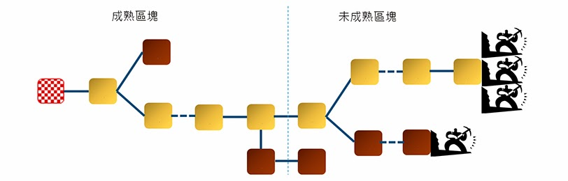

# Bitcoin 運作的特定細節

## 節點認證

從第一個區塊到各分支末端中所有區塊難度總和最高的分支稱為主分支，通常也是分支長度最長的。[區塊要再經過100 次挖到礦後才被認為成熟](https://en.bitcoin.it/wiki/Confirmation)，只有主分支上的成熟區塊才能獲得獎勵。

每筆交易被包在區塊中廣播出來就相當於一次確認，該區塊之後每多串連一個區塊也多一次確認。一般交易所或電子錢包的**交易都會要求6 次確認以上\(約略10分鐘出一次塊、6次確認恰為一小時\)。**

因為假設在網路暢通下，不誠實的礦工有雜湊率10％的運算能力，[這樣被駭的風險會在0.1％以下](https://en.bitcoin.it/wiki/Confirmation)。若是網路不暢通，則成熟與確認所需的次數都要增加！

## 節點的廣播

  

  

  

## 難度值\(Difficulty\)

 難度值（difficulty）是礦工們在挖礦時候的重要參考指標，它決定了礦工大約需要經過多少次哈希運算才能產生一個合法的區塊。比特幣的區塊大約每10分鐘生成一個，如果要在不同的全網算力條件下，新區塊的產生保持都基本這個速率，難度值必須根據全網算力的變化進行調整。

#### 簡單地說，難度值被設定在無論挖礦能力如何，新區塊產生速率都保持在10分鐘一個。

**難度的調整是在每個完整節點中獨立自動發生的。**每2016個區塊，所有節點都會按統一的公式自動調整難度，這個公式是由最新2016個區塊的**花費時長**與**期望時長**比較得出的。

（※期望時長為20160分鐘即兩周，是按每10分鐘一個區塊的產生速率計算出的總時長）

根據實際時長與期望時長的比值，進行相應調整\(或變難或變易\)。  
也就是說，如果區塊產生的速率比10分鐘快則增加難度，比10分鐘慢則降低難度。

$$
難度值 = 舊難度值 * ( 過去2016個區塊花費時長 / 20160 分鐘 )
$$

 我們也可以簡單理解成，比特幣工作量證明的過程，就是通過不停的變換區塊頭（即嘗試不同的nouce值）作為輸入進行SHA256哈希運算，找出一個特定格式哈希值的過程\(即要求有一定數量的前導0\)。

#### 而要求的前導0的個數越多，代表難度越大。

## Merkle Tree；哈希樹

