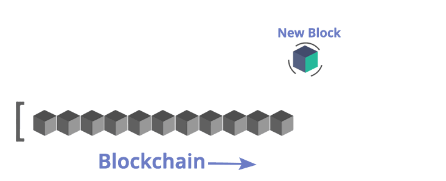

# 關於BTC延伸的其他部分

## 區塊鏈是什麼？比特幣是什麼？

許多人會說區塊鏈、是網路發明後最偉大的一次科技進程、所謂的「破壞性創新」。

至少就科技發展的角度來說、我認為區塊鏈與比特幣的價值，是將「網路所應該提供的服務」轉化成為世界上每一個人都應享有的各式**自由**。譬如**財富控管的自由**、**網路中立的自由**、**言論與思想上的自由**。

比特幣是一個基於去中心化、為了P2P而生的電子支付系統；我們得把時光追溯回去2008年11月1號，一位叫做中本聰的偉大發明家或組織所發表的論文《**一種點對點的電子現金系統**》。目前我們仍舊不知道中本聰是誰，而區塊鏈與比特幣最大的價值就是去中心化的概念；P2P則是針對個人對個人，藉此去除掉任何第三方與中介人的概念。

首先有幾個非常重要的概念，**比特幣不等於區塊鏈、區塊鏈也不等於比特幣**，兩者是不同的東西。更重要的是比特幣完全沒辦法匿名，而且由於公開帳本的概念，任何人都可以根據交易紀錄查出錢包內的貨幣有哪些餘額、剩下的就是找出誰"擁有"那個錢包地址\(address\)。

從論文中的導論可以了解、中本聰意求通過數學以及密碼學原理，提供一個**解決中心化仲介信用**\(金融機構\)的方案。讓彼此的交易可以順暢進行、不受任何中央機構所控制。然而值得去注意的是，儘管比特幣提供的交易管道\(媒介\)是革命性的、去除掉「中心化仲介的信用」，但卻**無法保證交易的雙方都是誠實可信**的。

在比特幣系統的運作裡，**交易的進行**都是**無法撤銷**與**回溯**的。這意味著就算對方騙了你、或是對方出現了信用問題，這筆交易是無法撤銷的。哪怕對方是騙了你，你的交易損失都是無法追回的。

這裡面便有一個悖論與問題，「**你是信任中心化中介的信用、**還是**信任你們交易雙方的信用」；**如果你選擇後者那麼比特幣系統是你的好選擇，如果你選擇前者，那麼傳統的中心化支付是你的選擇。

## 為何我們需要比特幣\(Bitcoin\)?

事出必有因。某一項科技發現，並非是它一開始有多成功，而是它嘗試解決我們人類既有社會的哪些缺點；發現問題後、促使那些人去找尋更佳的解決辦法。

與其他人介紹起比特幣、並非會先說明它本身有多好，而是會說說現在的人類社會出了哪些狀況，導致效率不彰與人為疏失所犯的錯誤一而再、再而三的發生。

### 比特幣的訴求是？

**點對點的電子現金系統**，它的目的也並非是取代所有既有的**法定貨幣**。

> #### 而是提供一種新形態的貨幣，叫做「**電子現金**」

首先點對點這個概念非常容易理解吧？每個人、每台手機都可以定義成為一個Point\(點\)，而想做出數位化的貨幣其實已經早在十幾年前就有了。

我們該如何避免你手中的數位貨幣跟我的數位貨幣一不一樣、有沒有仿冒所以我們需要一個防偽機制，就好比手上的紙鈔有防偽條碼。而中本聰關鍵的一點就是利用**數字簽名**\(Signature\)概念，來避免貨幣盜印與詐騙支付等等的問題；也就是為了達到**防止雙重支付**。

用**時間戳**的概念、來把每一筆交易的過程用時間不可回溯性紀錄下來，來確保沒有同一時間付款給兩個人這種事情，而整筆資料的打包與驗證時間又會跟雜湊方程式\(Hash function\)或是**雜湊表**\(Hash Table\)的運算有關，這些確認無誤的資料打包、壓縮後，便稱作**區塊\(Block\)。**

很多個區塊堆疊起來便叫做**區塊鏈\(Blockchain\)。**

這邊你只需要稍微彼此之間關係是甚麼 、了解到區塊鏈最重要最重要的概念就是：

> #### 區塊\(Block\)是隨著時間持續打包+堆疊，所以隨著時間流逝、鏈上資料只會愈來愈多；而且打包記錄之後上面的資料是彼此前後相扣的，近乎不可能更改的特性、可以說是解決了信任的問題。

#### 比特幣系統要解決的兩個主要問題：

* 去中心化的P2P系統
* 解決支付時產生的雙花問題

 **這里面需要註意的是比特幣系統代替的是中心化中介的信用，並不能保證交易雙方的信用。**

\*\*\*\*

## 為何需要共識機制\(Consensus\)？

> #### 共識機制的存在，目的就是為了解決一致性、同步性，達到安全來避免系統的崩潰。

####  

* 同步率、等待全網確認的時間、網路的傳輸速度影響
* 

## 比特幣網路 \(Network\)

直到今天，關於比特幣所帶來的意義與內在價值的話題仍舊充滿了不少爭議；但大部分人應該都會認可，比特幣是貨幣歷史上，甚至整個金融歷史上一次了不起的社會實驗。

比特幣網路自在 2009 年上線以來，在無人管理的情況下，已經在全球範圍內 **`7*24`**小時運行快九年的時間；成功處理了幾百萬筆交易，甚至支持過單筆 1.5 億美金的交易。更難能可貴的是，**比特幣網路從未出現過重大的系統故障**，**以及任何一秒的停擺或當機、一次也沒有。**


[http://bitcoinuptime.com/](http://bitcoinuptime.com/)  
比特幣網路同步率


比特幣網絡目前由數千個核心節點參與構成，不需要任何中心化的支持機構參與，純靠分布式機制、與簡單的數學函式支持了穩定上升的交易量。

比特幣首次真正從「實踐意義」上實現了**安全可靠**的**去中心化數字貨幣**機制，這也是它受到無數金融科技從業者熱捧的根本原因。作為一種概念貨幣，Bitcoin與**已有的貨幣系統相比**，傳統金融架構面臨的幾個核心問題：

* 被掌控在**單一機構**手中，容易被攻擊、或者操弄。 例如: 政府、銀行、資本家....
* 自身的價值無法保證，容易出現波動。
* 無法匿名化交易，不夠隱私。

在前文中也探討過，要實現一套數字貨幣機制，最關鍵的還是要建立一套完善的交易記錄系統，以及形成一套合理的貨幣發行機制。這個交易記錄系統要能準確、公正地記錄發生過的每一筆交易，並且**無法被惡意篡改**。對比已有的銀行系統的運行機制、作為金融交易的第三方中介機構，有代價地提供了交易記錄服務。如果參與交易的多方都完全相信銀行的記錄（數據庫），就不存在信任問題。

> #### 可是如果是更大範圍（甚至跨多家銀行）進行流通的貨幣呢？ 哪家銀行的系統能提供完全可靠不中斷的服務呢？

唯一可能的方案是搭建一種**分布式帳本**。這個帳本可以被**所有用戶自由訪問**，而且任何個體都無法對所記錄的數據進行惡意篡改和控制。為了實現這樣一個前所未有的帳本系統，比特幣網絡巧妙地設計了賽局理論、激勵制度\(Incentive Mechanism\)、經濟模型，提供了可靠、且相互牽制的經濟調節。

## 更有價值的區塊鏈技術

如果說比特幣是影嚮力巨大的社會學實驗，那麼從比特幣核心設計中提煉出來的區塊鏈技術，則讓大家看到了塑造更高效、更安全的未來商業網絡的可能。2014 年開始，比特幣背後的區塊鏈技術開始逐漸受到大家關註，並進一步引發了分布式記賬本（Distributed Ledger）技術的革新浪潮。

例如後續出現的以太坊\(Ethereum\)、隱匿幣\(Privacy Coin\)、超級帳本\(Heyperledger\)、IOTA等等。

> ※針對ETH、Heyperledger、IOTA、Cardarno....等等，可以被當作區塊鏈2.0之後的項目，  
> 我們後面會有獨立的章節做紀錄與討論。

##  **炒作的主要原因**

[2008 年的全球貨幣流通量（circulation） 總計已經超過4 兆美元](http://en.wikipedia.org/wiki/Circulation_%28currency%29)，其中最多的是歐元， 佔24.3 ％， 其次是美元，佔19.97％。[2013 年底美元流通量已經超過1.2 兆](http://www.federalreserve.gov/faqs/currency_12773.htm)，假設現有的1200 萬元比特幣取代美元一半的流通量，每元比特幣平均會是五萬美元。目標價如此之高，難怪大家知道了這種貨幣或商品之後會爭相買入，要不是因為種種疑慮與使用不方便，史上最高匯率會更高。既然是貨幣或商品的公開自由交易，就是一個願打一個願挨，不算是龐式騙局（俗稱老鼠會），更有助於炒作！

> ※後面會針對貨幣的角度、來對BTC有更細部的探討。



## 貨幣的非國家化

大家都明白貨幣貶值的困難、

弗里德里希·馮·哈耶克 \(Friedrich von Hayek\) 2007年所寫的《[貨幣的非國家化](https://book.douban.com/subject/2155342/)》

## 財富的分配不均

 雖然比特幣是匿名電子貨幣，從使用行為上還是可以估計所擁有者的分佈狀況。[2013 年12 月的統計](https://bitcointalk.org/index.php?topic=316297.0;all)是在超過2300 萬的比特幣位址裡，所屬用戶中估計有120 多萬戶擁有超過0.001 元比特幣、28 多萬戶超過1 元比特幣、930 多戶超過1000 元比特幣，其中一戶（可能是中本聰）超過98 萬元比特幣，最高價時超過十億美金！這樣分佈懸殊的狀況，再加上早期挖礦的成本低，炒作對既得利益者更有利，對眼紅者也更有吸引力。

 雖然工作量證明與獎勵機制可能真的是為了鼓勵用戶投入挖礦，同時幫忙檢驗，讓P2P 系統行得通。但是自從資本大量投入，引進更強的礦機與礦池後，就變成典型的資本壟斷問題，只要資本能得利，循環投入之後就會貧者愈貧、富者愈富，直到無利可圖為止。

其實發行電子貨幣的成本應該是很低的，目前較費「勞力」的交易手續費平均通常佔不到獎勵的[0.5％](https://blockchain.info/stats)，比信用卡的抽成還高，大家也沒有太大興趣，因此顯然挖礦有利可圖，也還不用開始作弊。

有能力挖到礦的人自然會想辦法炒高比特幣匯率，甚至會炒高礦機的價格。於是，一般人就不用挖了，不放棄就只能投入礦池，讓礦池繼續剝削，也讓礦池越長越大，越能興風作浪。  

