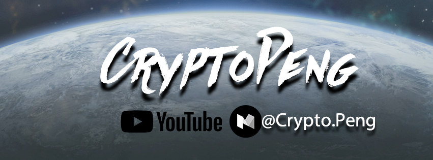

# 比特幣&黃金－持有者的心智與信心

> _我們把時空追溯到二次世界大戰，貨幣發生貶值、政府的公信力低落時，民眾把所有有價資產帶在身上而去避難。在當時，黃金無庸置疑是個最保值的商品，因為在當時，黃金是最好隨身攜帶又最有價值的有形資產。_

考慮這段二戰時代的背景_\(1940s\)後，_值得討論的問題是:  
 1.**貨幣**發生貶值的原因?   
 2.**政府**的公信力低落&紙鈔的關係  
 3.**黃金**的攜帶性&全世界通用的承認價值

在德國投資金融家**科斯托蘭尼**所註《**一個投機者的告白**》  
是這麼形容當時他所經歷二次世界大戰的交易市場：

> #### 在這種情形下，股票不再有用，因為這些股票在收容難民的國家裡賣不出去，收容難民的國家有外匯管制，所以無法處理外國貨幣。或是持股的公司、工廠在戰爭轟炸中遭到破壞，會被收歸國有，匈牙利在戰爭結束後變成共產主義國家時，我父親的酒廠就遭到此等命運。結果是大家都失去自己的投資，在這種情況下，只有國際通用的貨幣，或某個沒有捲入戰爭的國家的貨幣、或是黃金才有用。

的確；在那樣子的狀況下，黃金幾乎是人民所及最好的避險、以及保護資產價值的一種方式。

但我們必須同意，現在的我們完全**無法回歸到金本位制**，尤其黃金本身特性所帶來的停滯難行，它會阻礙交易的**"流通"**；礙於天然的受限、間接導致我們世界的經濟發展而逐漸遲緩，這是過去黃金以本位時所面臨的問題。

#### 那麼，我們得先思考....　

## 為何我們還需要黃金這項商品？

> #### →為了調節國際收支，形成固定的外匯價格。

簡單的說就是每種貨幣都用黃金來定價。譬如：一美元等於多少克黃金

所以才有規定中央銀行對流通的紙鈔法幣，必須保持對應的黃金儲備量；且中央銀行有義務按照固定價格，**以黃金買進本國貨幣，或支出本國貨幣購買黃金**。

像是當一個國家在**貿易結算**或**國際收支**上出現赤字，導致貨幣在國外供給量過大時，該國中央銀行也就有義務用黃金把這些海外流通過量的貨幣從市場上購回。

但事實是，為了上述的平衡與調節，倘若碰到財政赤字，為了避免本國黃金的流失，中央銀行能採取的措施有**提高利率**和減少開支、縮減貸款或是提高稅收，好增加資金流入，就是一系列的**通貨緊縮**。

它會掏空所有平民老百姓口袋裡的錢，減少大家消費的需求，造成失業率的提高，為的就是保存好黃金的存量；這才是以黃金為本位時，國家得以財政維持正常運轉的原理，反之亦然。

**結果就是沒有人敢這麼做！**因為一系列通貨緊縮，會導致民怨四起，按照這樣的體系而執行時，會導致當局政府在下次選舉中落選，沒有人願意拿石頭砸自己腳。

> #### 結果就是以**黃金為本位**時一點用都沒有，原因是它太慢了。

這是**安德烈‧科斯托蘭尼**\(Andre Kostolany\)在書中所闡述的，他認為金本位一點用處都沒有。甚至提及了當時實施金本位後，所造成的通貨緊縮問題，或許與間接導致希特勒與第三帝國的出現有某種程度的關係。

畢竟，經濟形勢和選舉結果間的關聯是**假如生活艱難，肯定會發生革命。**

## 那麼....合格的貨幣又該有哪些特性？

1. **抗通膨**：可能是衡定數量、或擁有一定的稀缺性
2. **流動性**\(Liquidity\)：轉移迅速、不易察覺又可隨身攜帶
3. **全世界認可與辨識\(共識\)**：只要有電、有網路的地方即可轉移

提到流通性，相比一個資產雄厚的人，試想帶著某些數量的金項鍊、金戒指在身上會有多容易遭搶劫就好，這是一個致命的缺點；倘若你是個會在不同國家移動的人，試想不同國家使用不同貨幣有多不方便。且別跟我說非洲人北極人不會收比特幣，黃金對他們來說也是相對不一定承認、且依舊波動很大，他會高估或低估黃金的價格，就是不會跟你我在一般國際市場價格所認定的一樣；當然，網路的推廣與普及，也是早該解決的事情。

回到比特幣可以帶給我們什麼，對我來說現在的科技發展已經進展到需要更加便利的媒介來讓我們使用。沒錯，黃金實在太慢了，而比特幣的出現絕對會改變人類文明發展的歷史，以及所有人對金融、貨幣的了解。

更嚴格的來說，是「[**區塊鏈**](https://zh.wikipedia.org/zh-tw/%E5%8C%BA%E5%9D%97%E9%93%BE)」帶給我們更多對未來的想像。

## 《比特幣 Bitcoin》

把時間軸拉回歸至2008年，名叫中本聰的人第一次在網路發表了這篇論文，提到了區塊鏈的概念、與衍生出的新的金融支付系統:

**《**[**比特幣:一種點對點的電子現金系統**](http://satoshinakamoto.me/zh-tw/bitcoin.pdf)**》**

在這邊就不多做解釋它的技術原理，例如**公開帳本**、**公鑰/私鑰**、**時間戳記**、**工作量證明**\(PoW\)、**節點**\(nodes\)與**區塊**\(blocks\)，再到所謂的**區塊鏈技術**都是非常值得深入了解的，而密碼學的原理是建構在數學而非信用，解決了過往的**信任問題**，在這邊就不花篇幅講解，有興趣的人可以進一步搜尋，有非常非常多容易理解的影片。

值得讓人注意的是，中本聰這位神秘的發明家，論文中直接點出他對於目前網路貿易所面臨的問題，就是都得需要**借助金融機構**作為信任擔保的這件事。

在近百年來的人類社群活動中，都是由一方來處裡**仲介**與**中轉**，除了多了很多步驟與鏈結以外，更無形中增添了許多**傳遞成本。**

當然，這也是非常**中心化**的一種模式。借助區塊鏈的力量，我們節省的不只是金錢，而是**時間**。

舉例來說，現在你使用行動支付購買商品/服務，你得拿出信用卡發出資訊告知你的信用卡公司/銀行說你要付費，接著銀行再跑一大圈確認是你的要求後，才將訊息送出到對方的銀行，這樣子中介的過程，除了損失了好幾百分比的傳遞手續費以外，**時間成本**、無謂的**信任成本**，都隱含在裡面；更別提跨國匯款、外幣換匯、支票兌換等等，都有週期長、費用高的缺點，而根本原因其實就是**制度**與**系統**上所造成的凝滯與層層剝削，以及**效率不彰**。

> #### 「你現在還認為我們所存在的社會與價值，一切都是那麼完美嗎？」

這張圖是黃金與BTC價格波動圖\(紫線:黃金、藍線:BTC\)

## 《黃金＆比特幣》- 價格關係?

至目前為止，黃金的漲幅波動並沒有隨著BTC有絕對的相關；可以注意的是，**當BTC在2017.11月的歷史高點時，黃金的價格竟呈現相對低點。**

當然，目前我們的分析樣本數還不夠多，畢竟BTC是2008年才出現的工具，到了近幾年才開始慢慢被大眾所注意。

並且客觀地來說，BTC擅未在金融、經濟的**蕭條**與**崩潰**下經過任何的壓力測試，只能說未來會怎麼發展我們還不確定，但很幸運的是我們每一個人都可以見識到BTC能不能取代黃金這件事情。

> #### 黃金的所有低點並沒有帶動比特幣有絕對上漲的跡象， 所以我們暫不能肯定黃金與比特幣具有絕對關聯。

## 「錢應當只是一種手段，而非目的。」

值得讓我們省思的是，錢對我們來說到底是甚麼？我認為這才是值得思考的事。也許是因為華人先天的文化特性，對長輩來說公開談論金錢是個隱晦與可恥的象徵，逐漸地大家都逃避去談論。

而它卻是最貼近我們自身生活的議題、也是一個每個人都必須去學著正視的問題，嘗試去了解並思考對你來說貨幣所該被賦予的意義。

> #### 最重要的是擁有正確的金錢觀念，正視它所被賦予的功能；

> #### **貨幣的發展，為的應該是幫助更多人擺脫貧窮， 而不是為了打擊窮人。**

有一篇[**國外的文章**](http://money.visualcapitalist.com/worlds-money-markets-one-visualization-2017/)是有關全世界有多少錢的統計圖，文章末有個問題我覺得挺有意思的。

## 《所以….**世上到底有多少錢？》**

有個鄉民提問說世界上總共存在多少的錢?  
這位統計學家的回答很有意思，他說

> #### 值得探討的應該是，你怎麼定義Money? 它取決於你怎麼看待；
>
> #### 是指那些由中央銀行所製造的「**Really money**」嗎?  還是黃金、比特幣、以及其他硬性資產?

對我來說，我家那隻貓也是我的無價資產、更別說那些與朋友相伴的時光，你說對吧?

[卡爾·馬克思](https://zh.wikipedia.org/wiki/%E5%8D%A1%E5%B0%94%C2%B7%E9%A9%AC%E5%85%8B%E6%80%9D)\(_Karl Marx_\)曾在《資本論》中是這麼說的**「金銀天然不是貨幣，但貨幣天然是金銀」。**

貨幣的用途，不外乎"**價值尺度、支付手段、貯藏財富**"三種手段；而2018年的現在比特幣幾乎有上述所說的所有功能，而比特幣在許多人心目中的價值，早已比黃金高過很多很多了。我們更可以斷言:

> #### 比特幣的**價格**，完全取決於人民對政府的**信任**有多少

當人民愈不信任銀行時、比特幣的價格就會飛漲，反之則是下降。

不可否認的是，比特幣的出現拉開了人類地圖金融與科技的序曲，更是藉由金錢的追逐把所有人的目光帶來到這塊瘋狂的派對裡，何時會到尾聲我們沒辦法預料，但值得讓人擔心的是夢幻與浮華的光芒裡，也藏了許多各懷鬼胎，名為投機、狂熱、貪婪、甚至是欺瞞的份子。

**唯一能做的便是在這波洪流中找到自己所堅信的價值，那就好了。**

