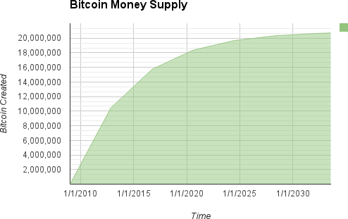

# 60% Ch8:網路

### Peer-to-peer Network Architecture \(點對點網路架構\)

介紹P2P網路底層架構

### Node Types and Rules

BTC節點類型與規則

#### The Extended Bitcoin Network

擴展、額外的比特幣網路細節

### Bitcoin Relay Network\(中繼、轉發網路\)

雖然比特幣P2P網路滿足各種節點類型的一般需求，但它對比特幣挖掘節點的特殊需求表現出太高的網路延遲\(網路速度很重要!\)

## \*Network Discovery

介紹版本號、如何廣播、

**nVersion** - The bitcoin P2P protocol version the client "speaks" \(e.g., 70002\)

**nLocalServices** - A list of local services supported by the node, currently just NODE\_NETWORK

**nTime** - The current time

**addrYou** - The IP address of the remote node as seen from this node

**addrMe** - The IP address of the local node, as discovered by the local node

**subver** - A sub-version showing the type of software running on this node \(e.g., `/Satoshi:0.9.2.1/`\)

**BestHeight**  - The block height of this node’s blockchain  
\(See [GitHub](http://bit.ly/1qlsC7w) for an example of the version network message.\)




```text
$ bitcoin-cli getpeerinfo
[
    {
        "addr" : "85.213.199.39:8333",
        "services" : "00000001",
        "lastsend" : 1405634126,
        "lastrecv" : 1405634127,
        "bytessent" : 23487651,
        "bytesrecv" : 138679099,
        "conntime" : 1405021768,
        "pingtime" : 0.00000000,
        "version" : 70002,
        "subver" : "/Satoshi:0.9.2.1/",
        "inbound" : false,
        "startingheight" : 310131,
        "banscore" : 0,
        "syncnode" : true
    },
    {
        "addr" : "58.23.244.20:8333",
        "services" : "00000001",
        "lastsend" : 1405634127,
        "lastrecv" : 1405634124,
        "bytessent" : 4460918,
        "bytesrecv" : 8903575,
        "conntime" : 1405559628,
        "pingtime" : 0.00000000,
        "version" : 70001,
        "subver" : "/Satoshi:0.8.6/",
        "inbound" : false,
        "startingheight" : 311074,
        "banscore" : 0,
        "syncnode" : false
    }
]
```


## Full Nodes 

* 獨立驗證所有交易的能力
* 脫離中央機構的代價、自由的代價；硬碟空間

### \*Exchanging "Inventory"  \(區塊同步\)

介紹區塊如何驗證彼此帳本、當前位置，如何同步。


## Simplified Payment Verification\(SPV\)

當然啦，也並非每個節點都必須儲存所有的區塊鏈帳本。

基於硬碟空間、網路速度、使用者操作的平台，可能有智慧型手機、筆電、桌上型電腦、甚至是嵌入式系統，這些**簡易型的支付驗證\(SPV\)**有其存在的必要性。SPV客戶端又被稱作輕量型的客戶端，這在BTC能否應付各式支付場景扮演著重要角色、決定於BTC能否被大眾採用的關鍵之一。

SPV節點只下載區塊的標頭檔\(header\)、不必下載所有區塊上的交易資料。與全節點上的所有帳本相比，大概省了1000倍的硬碟空間。而沒有全部資料意味著不能實施花費\(Spending\)的動作；但可以使用約略不同的方法來驗證交易\(verify Tx\)，該方法只需要仰賴其他點所提供**部份相關的區塊鏈部份**。

* get\_headers 訊息的動作
* SPV節點需要設置個過濾器\(filter\)
* 針對特定交易才要求header、getdata等等取得資訊的動作，會不經意地暴露危險。任何人可以根據消費習慣追蹤到你的錢包地址、以及有多少錢。
* 更別說你不希望餐廳老闆知道你錢包內有多少BTC資產。


BTC開發為了解決這一問題，增加了"Bloom Filter"、好解決上述SPV/lightweight節點的隱私風險。

### Bloom Filters

Bloom過濾器提供了一個"概率性的判斷機制"，允許SPV節點向對等節點查詢交易信息、同時又不會泄露交易地址，在有效搜索關鍵詞的同時保護隱私。

* 問路情形相似；不再詢問特定目的地、路線怎麼走，而是問一個開放式問題，得到一個混淆的答案。
* 雖然得到的結果與資訊較少、但相對安全與保護隱私，只是增加詢問次數。
*  A less specific bloom filter will produce more data about more transactions, many irrelevant to the node, but will allow the node to maintain better privacy.

### How Bloom Filters Work

> Bloom filters are implemented as a variable-size array of N binary digits \(a bit field\) and a variable number of M hash functions. ......
>
>  **By choosing different length \(N\) bloom filters and a different number \(M\) of hash functions, the bloom filter can be tuned, varying the level of accuracy and therefore privacy.**


* Filter是一種概率的資料結構\( probabilistic data structure\)；隨著更多模式的添加，它變得愈來愈準確。
* 如果某個輸入不符合、其中一個Hash出來後會指向零，那麼代表這輸入絕對沒有機會是我們要的數值。
* .....


### How SPV Nodes Use Bloom Filters

> Bloom filters are used to filter the transactions \(and blocks containing them\) that an SPV node receives from its peers, selecting only transactions of interest to the SPV node without revealing which addresses or keys it is interested in.

......


 The **network protocol** and **bloom filter mechanism** for SPV nodes is defined in [BIP-37 \(Peer Services\)](http://bit.ly/1x6qCiO).


### SPV Nodes and Privacy

* 全節點比SPV節點安全。
* 不會只reveals 部份地址、自然不容易被歸類或者篩選出使用者的相關資訊。
* 但Bloom過濾器並非萬靈藥\(靠?\)
* 隨著時間推移、監控者依舊可以靠足夠的訊息量，推估其SPV客戶端的錢包地址與其它使用者相關資訊。

## Encrypted and Authenticated Connections

許多使用BTC的使用者認為節點都是有加密的，實際上不然。而為了增加隱私性與安全性，比特幣開發社群有兩個主要解決方案: **Tor Transport** & **P2P Authentication and Encryption**

**Tor Transport**

跟Onion Routing network有關，讓資料可以加密與難以追蹤的隨機網路途徑\(randomized network paths\)，提供一個匿名、難以追蹤、以及隱私。

> You can find more instructions on running Bitcoin Core as a Tor hidden service in the Bitcoin Core documentation \(_docs/tor.md_\) and various online tutorials.

**Peer-to-Peer Authentication and Encryption**

如前所述，有兩個更新進展協議 BIP-150 以及 BIP-151，分別是增加P2P認證\(P2P authentication\)以及進一步加密\(encryption\)在比特幣的P2P網路中。這兩個BIP協議讓節點們可以自定義是否兼容這些額外的近期開發功能。

BIP151 為支持所有實施BIP151協議的節點、通訊時，協商彼此的資料是否要進行加密。

BIP150提供自選的對等身分驗證，允許節點使用ECDSA and 私鑰來驗證彼此的身分。BIP150要求在認證之前，兩個節點已根據BIP151建立了加密通信。

 BIP-150和BIP-151允许用户运行连接到受信任的完整节点的SPV客户端，使用加密和身份验证来保护SPV客户端的隐私。


 The standard is defined in [BIP-150 \(Peer Authentication\)](https://github.com/bitcoin/bips/blob/master/bip-0150.mediawiki) and [BIP-151 \(Peer-to-Peer Communication Encryption\)](https://github.com/bitcoin/bips/blob/master/bip-0151.mediawiki)


## Transaction Pools \(交易池\)

幾乎所有的節點都會有一個暫時的池子，儲存所有未經確認\(unconfirmed\)的交易，在記憶體暫存池_\(memory pool, mempool\)_  。節點藉由池中儲存的交易\(Tx\)、來判斷有哪些交易發生在BTC網路中，但這些交易還沒被驗證、也還沒被打包紀錄在區塊鏈上。

譬如一個錢包節點可以藉由交易池\(Tx pool\)判斷、用戶錢包是否收到付款資訊；當然這只是第一步接收資訊、並不代表交易的有效性。\(尚未被礦工驗證unconfirmed\)

在接收和驗證事務時，它們被添加到事務池\(Tx pool\)並轉發\(relayed\)給鄰居節點、進而散播出去至網路中。

**而某些節點還會維護單獨的孤立事務池。**如果事務\(Tx\)的輸入、引用了尚未發現過的交易事務\(例如找不到他的父交易事務\)，則這個孤立的交易事務會被臨時存放在"孤立池\(orphan pool\)"，直到他的父交易事務到達為止。

> When a transaction is added to the transaction pool, the orphan pool is checked for any orphans that reference this transaction’s outputs \(its children\). **Any matching orphans are then validated.** 
>
> **If valid, they are removed from the orphan pool and added to the transaction pool**, completing the chain that started with the parent transaction. 
>
> In light of the newly added transaction, which is no longer an orphan, the process is repeated recursively looking for any further descendants, until no more descendants are found. 
>
> Through this process, **the arrival of a parent transaction triggers a cascade reconstruction of an entire chain of interdependent transactions by re-uniting the orphans with their parents all the way down the chain.**

不管是交易池\(Tx pool\)還是孤立池\(orphan pool\) 都被存放在本地的記憶體區、且不會永久被儲存起來，它們會根據網路中收到的訊息動態調整。當節點剛啟動時，兩個池都為空，並且逐漸填充網路上收到的新交易事務。

而某些BTC客戶端運型的節點會維持 UTXO pool的運行\(聽起來跟Tx Pool很像、但不同\)；UTXO池初始化並非為空、而是包含數百萬條未花費的交易輸出\(unspent transaction outputs\)，一直遵循到一開始的創世區塊。UTXO池可以存放在本地存儲器中，也可以作為永久存儲器上的索引數據庫表。

節點與節點之間的Tx Pool 與 Orphan Pool可能不盡相同、取決該節點何時開始運作與紀錄。UTXO池代表了網路的**緊急共識\(the emergent consensus of the network\)**，因此這部分在節點之間差異甚小。最重要的是，**Tx & Orphan 池只包含未經確認的交易\(unconfirmed Tx\)；而UTXO池僅包含已確認的輸出。**


